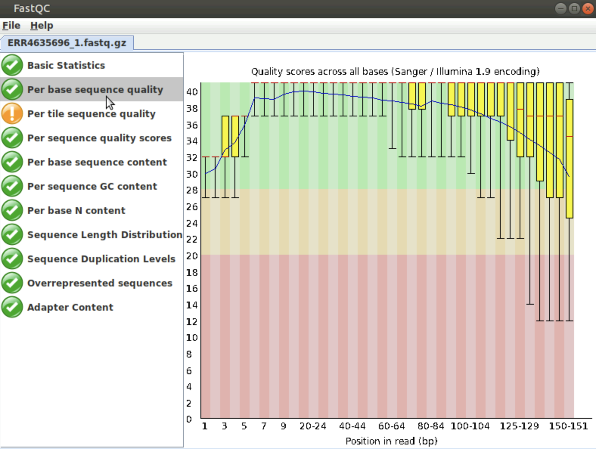
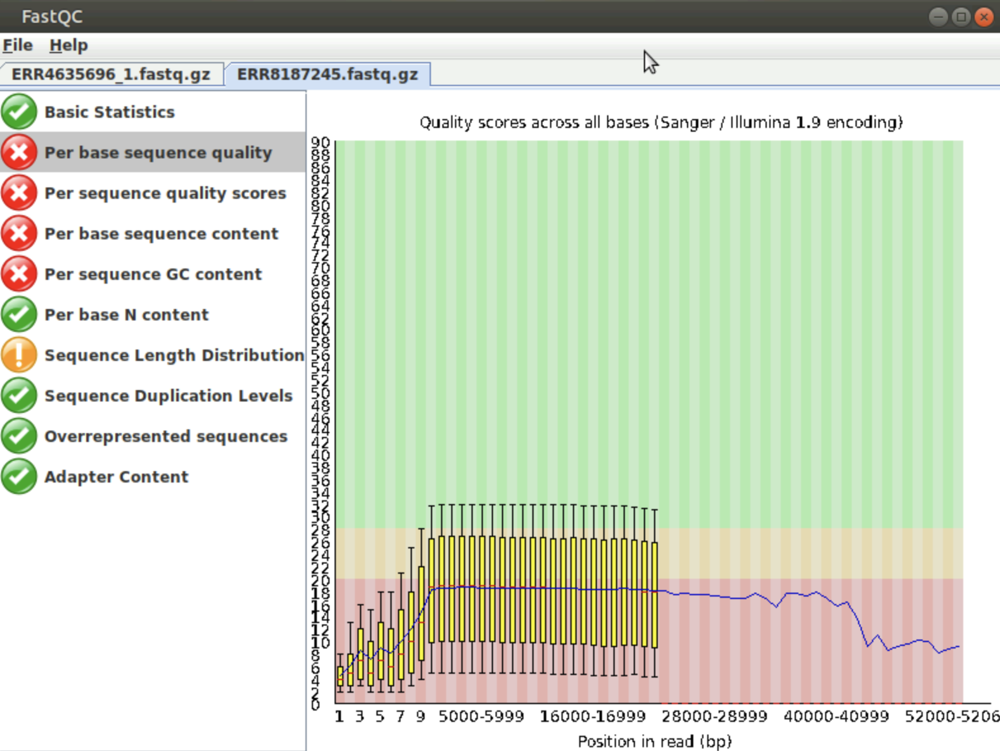
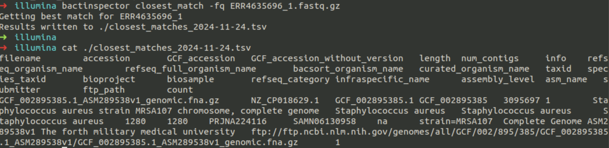

# Learning outcomes:

By the end of this module, you will be able to

1\. Perform quality control (QC) assessments on FASTQ-formatted sequence data obtained from both short and long reads sequencing technologies.

2\. Critically evaluate and interpret QC outputs to determine data reliability.

# Introduction

## Brief recap

Below you can find a list of frequently used commands for you to remember them:

| Command | What it does                                             |
|---------|----------------------------------------------------------|
| ls      | Lists the contents of the current directory              |
| mkdir   | Makes a new directory                                    |
| mv      | Moves or renames a file                                  |
| cp      | Copies a file                                            |
| rm      | Removes a file                                           |
| mkdir   | Makes a new directory                                    |
| cat     | Concatenates files                                       |
| more    | Displays the contents of a file one page at a time       |
| head    | Displays the first ten lines of a file                   |
| tail    | Displays the last ten lines of a file                    |
| cd      | Changes current working directory                        |
| pwd     | Prints working directory                                 |
| find    | Finds files matching an expression                       |
| grep    | Searches a file for patterns                             |
| wc      | Counts the lines, words, characters, and bytes in a file |
| kill    | Stops a process                                          |

## Commonly used file formats for NGS data

### FASTA

Among the most common and simplest file formats for representing nucleotide sequences is FASTA. Essentially, each sequence is represented by a 'header' line that begins with a '\>', followed by lines containing the actual nucleotide sequence. By convention, the first 'word' in the header line is a unique identifier, which is usually the accession number. Consider this portion of the whole genome of *Staphylococcus aureus* MRSA252 as an example of a FASTA-formatted nucleotide sequence:

```         
  >NC_002952.2 Staphylococcus aureus subsp. aureus MRSA252, complete sequence
  CGATTAAAGATAGAAATACACGATGCGAGCAATCAAATTTCATAACATCACCATGAGTTTGATCCAAAGCATGAGTGTTT
  ACAATGTTTGAATACCTTATACAGTTCTTATACATACTTTATAAATTATTTCCCAAGCTGTTTTGATACACACACTAACA
  GATACTCTATAGAAGGAAAAGTTATCCACTTATGCACACTTATACTTTTTAGAATTGTGGATAATTAGAAATTACACACA
  AAGTTATACTATTTTTAGCAACATATTCACAGGTATTTGACATATAGAGAACTGAAAAAGTATAATTGTGTGGATAAGTC
  GTCCAACTCATGATTTTATAAGGATTTATTTATTGATATTTACATAAAAATACTGTGCATAACTAATAAGCAGGATAAAG
  TTATCCACCGATTGTTATTAACTTGTGGATAATTATTAACATGGTGTGTTTAGAAGTTATCCACGGTTGTTATTTTTGTG
  TATAACTTAAAAATTTAAGAAAGATGGAGTAAATTTATGTCGGAAAAAGAAATTTGGGAAAAAGTGCTTGAAATTGCTCA
  AGAAAAATTATCAGCTGTAAGTTACTCAACTTTCCTAAAAGATACTGAGCTTTACACGATCAAAGATGGTGAAGCTATCG
  TATTATCGAGTATTCCTTTTAATGCAAATTGGTTAAATCAACAATATGCTGAAATTATCCAAGCAATCTTATTTGATGTT
  GTAGGCTATGAAGTAAAACCTCACTTTATTACTACTGAAGAATTAGCAAATTATAGTAATAATGAAACTGCTACTCCAAA
  AGAAGCAACAAAACCTTCTACTGAAACAACTGAGGATAATCATGTGCTTGGTAGAGAGCAATTCAATGCCCATAACACAT
  TTGACACTTTTGTAATCGGACCTGGTAACCGCTTCCCACATGCAGCGAGTTTAGCTGTGGCCGAAGCACCAGCCAAAGCG
  TACAATCCATTATTTATCTATGGAGGTGTTGGTTTAGGAAAAACCCATTTAATGCATGCCATTGGTCATCATGTTTTAGA
  TAATAATCCAGATGCCAAAGTGATTTACACATCAAGTGAAAAATTCACAAATGAATTTATTAAATCAATTCGTGATAACG
```

-   The first line begins with '\>' indicating that it is the header line.
-   This is immediately followed by 'NC_002952.2', which is the accession number for [this sequence in the NCBI Assembly database](https://www.ncbi.nlm.nih.gov/assembly/GCF_000011505.1).
-   Then follows the actual nucleotide sequence, split over several lines.

It is very common to combine multiple sequences into a single multi-FASTA file like this:

```         
>ctxB1
ATGATTAAATTAAAATTTGGTGTTTTTTTTACAGTTTTACTATCTTCAGCATATGCACAT
GGAACACCTCAAAATATTACTGATTTGTGTGCAGAATACCACAACACACAAATACATACG
CTAAATGATAAGATATTTTCGTATACAGAATCTCTAGCTGGAAAAAGAGAGATGGCTATC
ATTACTTTTAAGAATGGTGCAACTTTTCAAGTAGAAGTACCAGGTAGTCAACATATAGAT
TCACAAAAAAAAGCGATTGAAAGGATGAAGGATACCCTGAGGATTGCATATCTTACTGAA
GCTAAAGTCGAAAAGTTATGTGTATGGAATAATAAAACGCCTCATGCGATTGCCGCAATT
AGTATGGCAAATTAA
>ctxB10
ATGATTAAATTAAAATTTGGTGTTTTTTTTACAGTTTTACTATCTTCAGCATATGCACAT
GGAACACCTCAAAATATTACTGATTTGTGTGCAGAATACCCCAACACACAAATATATACG
CTAAATGATAAGATATTTTCGTATACAGAATCTCTAGCTGGAAAAAGAGAGATGGCTATC
ATTACTTTTAAGAATGGTGCAATTTTTCAAGTAGAAGTACCAGGTAGTCAACATATAGAT
TCACAAAAAAAAGCGATTGAAAGGATGAAGGATACCCTGAGGATTGCATATCTTACTGAA
GCTAAAGTCGAAAAGTTATGTGTATGGAATAATAAAACGCCTCATGCGATTGCCGCAATT
AGTATGGCAAATTAA
>ctxB11
ATGATTAAATTAAAATTTGGTGTTTTTTTTACAGTTTTACTATCTTCAGCATATGCACAT
GGAACACCTCAAAATATTACTGATTTGTGTGCAGAATACCCCAACACACAAATACATACG
CTAAATGATAAGATATTTTCGTATACAGAATCTCTAGCTGGAAAAAGAGAGATGGCTATC
ATTACTTTTAAGAATGGTGCAACTTTTCAAGTAGAAGTACCAGGTAGTCAACATATAGAT
TCACAAAAAAAAGCGATTGAAAGGATGAAGGATACCCTGAGGATTGCATATCTTACTGAA
GCTAAAGTCGAAAAGTTATGTGTATGGAATAATAAAACGCCTCATGCGATTGCCGCAATT
AGTATGGCAAATTAA
>ctxB12
ATGATTAAATTAAAATTTGGTGTTTTTTTTACAGTTTTACTATCTTCAGCATATGCACAT
GGAACACCTCAAAATATTACTGATTTGTGTGCAGAATACCACAACGCACAAATATATACG
CTAAATGATAAGATATTGTCGTATACAGAATCTCTAGCTGGAAACAGAGAGATGGCTATC
ATTACTTTTAAGAATGGTGCAACTTTTCAAGTAGAAGTACCAGGTAGTCAACATATAGAT
TCACAAAAAAAAGCGATTGAAAGGATGAAGGATACCCTGAGGATTGCATATCTTACTGAA
GCTAAAGTCGAAAAGTTATGTGTATGGAATAATAAAACGCCTCATGCGATTGCCGCAATT
AGTATGGCAAATTAA
>ctxB2
ATGATTAAATTAAAATTTGGTGTTTTTTTTACAGTTTTACTATCTTCAGCATATGCACAT
GGAACACCTCAAAATATTACTGATTTGTGTGCAGAATACCACAACACACAAATACATACG
CTAAATGATAAGATATTGTCGTATACAGAATCTCTAGCTGGAAAAAGAGAGATGGCTATC
ATTACTTTTAAGAATGGTGCAACTTTTCAAGTAGAAGTACCAGGTAGTCAACATATAGAT
TCACAAAAAAAAGCGATTGAAAGGATGAAGGATACCCTGAGGATTGCATATCTTACTGAA
GCTAAAGTCGAAAAGTTATGTGTATGGAATAATAAAACGCCTCATGCGATTGCCGCAATT
AGTATGGCAAATTAA
```

If you want a more detailed history of the FASTA file format, then you could take a look at the Wikipedia page here: <https://en.wikipedia.org/wiki/FASTA_format>.

### FASTQ {#fastq}

The widely used FASTA file format has the great advantage of simplicity. However, this simplicity can be restrictive if we want to include additional data/metadata in addition to the sequence.

Given the non-negligible error rates of NGS technologies, often we need to accompany our sequence data with quality scores that estimate our confidence in the accuracy of the sequence data. As we will see later, this allows us to perform quality control checks and filter-out poor-quality data before performing analyses.

**FASTQ** is a simple text-based format that allows us to include quality scores. A single sequence is represented by four lines of text:

```         
@ERR8261968.1 1 length=97
ACTTTCGATCTCTTGTAGATCTGTTCTCTAAACGAACTTTAAAATCTGTGTGGCTGTCACTCGGCTGCATGCTTAGTGCACTCACGCAGTATAATTA
+
ERR8261968.1 1 length=97
CCCCCFDDFFFFGGGGGGGGGGHHHHHHHHHHHGGGGHHHHHHHHHHHHHHHGHHGHHIIHHGGGGGGHHHHHHHHHHHHHHHHHHHGGGHHHHHHH
```

-   The first line is a 'header' containing a unique identifier for the sequence and, optionally, further description.
-   The second line contains the actual nucleotide sequence.
-   The third line is redundant and can be safely ignored. Sometimes it simply repeats the first line. Sometimes it is blank or just contains a '+' character.
-   The fourth line contains a string of characters that encode quality scores for each nucleotide in the sequence on [ASCII code](https://en.wikipedia.org/wiki/ASCII).

Each single character encodes a score, typically a number between 0 and 40; this score is encoded by a single character.

| Character | ASCII | FASTQ quality score (ASCII – 33) |
|-----------|-------|----------------------------------|
| !         | 33    | 0                                |
| “         | 34    | 1                                |
| \#        | 35    | 2                                |
| \$        | 36    | 3                                |
| \%        | 37    | 4                                |
| ...       | ...   | ...                              |
| C         | 67    | 34                               |
| D         | 68    | 35                               |
| E         | 69    | 36                               |
| F         | 70    | 37                               |
| G         | 71    | 38                               |
| H         | 72    | 39                               |
| 40        | 73    | 40                               |

So, in the example above, we can see that most of the positions within the 97-nucleotide sequence have scores in the high 30s, which indicates a high degree of confidence in their accuracy.

\- A score of 30 denotes a 1 in 1000 chance of an error, i.e. 99.9% accuracy.

\- A score of 40 denotes a 1 in 10,000 chance of an error, i.e. 99.99% accuracy.

You can read more about the FastQ file format and quality scores here:

Cock, P. J., Fields, C. J., Goto, N., Heuer, M. L., & Rice, P. M. (2010). The Sanger FASTQ file format for sequences with quality scores, and the Solexa/Illumina FASTQ variants. *Nucleic Acids Research*, **38**, 1767–1771. <https://doi.org/10.1093/nar/gkp1137>.

### SAM and BAM

A **SAM file** (usually named \*.sam) is used to represent aligned sequences. It is particularly useful for storing the results of genomic or transcriptomic sequence reads aligned against a reference genome sequence. The **BAM file** format is a compressed form of SAM. This has the disadvantage that it is not readable by a human but has the advantage of being smaller than the corresponding SAM file and thus easier to share and copy between locations.

You can read about SAM and BAM formats here:

\- Li, H., Handsaker, B., Wysoker, A., Fennell, T., Ruan, J., Homer, N., Marth, G., Abecasis, G., Durbin, R., & 1000 Genome Project Data Processing Subgroup (2009). The Sequence Alignment/Map format and SAMtools. *Bioinformatics*, **25**, 2078–2079. <https://doi.org/10.1093/bioinformatics/btp352> - <https://samtools.github.io/hts-specs/SAMv1.pdf>.

We can view BAM files graphically using specialised genome browsers software such as (we will be working with one of them in the Genome Visualisation Tools module):

\- [IGV](https://igv.org/)

\- [Artemis](http://sanger-pathogens.github.io/Artemis/Artemis/)

An example **SAM file** is shown in the image below, along with the 11 mandatory fields of this standard:


(*Image from [Data Wrangling and Processing for Genomics](https://datacarpentry.org/wrangling-genomics)*)

The meaning of each of these mandatory fields are detailed below:


# Quality Control

#### Data retrieval from the European Nucleotide Archive (ENA)

The European Nucleotide Archive (ENA) provides a comprehensive record of the world’s nucleotide sequencing information, covering raw sequencing Data, sequence assembly information and functional annotation.

Access to ENA Data is provided through the browser, through search tools, through large scale file download and through the API.

### Download the Data programatically

1.  Connect to your Amazon EC2 Ubuntu instance via ssh or via the web interface.

### How to retrieve Data for the samples G18255819 and G18252308 from ENA

3.  Create a directory called Data in /home/ubuntu/

`mkdir /home/ubuntu/Data`

3.  Create subdirectories for each of your samples

    `mkdir /home/ubuntu/Data/G18255819/illumina`

    `mkdir /home/ubuntu/Data/G18255819/nanopore`

    `mkdir /home/ubuntu/Data/G18252308/illumina`

    `mkdir /home/ubuntu/Data/G18252308/nanopore`

4.  Download the reads for each sample

`cd /home/ubuntu/Data/G18255819/nanopore`

`wget ftp://ftp.sra.ebi.ac.uk/vol1/fastq/ERR818/004/ERR8187234/ERR8187234.fastq.gz`

`cd /home/ubuntu/Data/G18255819/illumina`

`wget ftp://ftp.sra.ebi.ac.uk/vol1/fastq/ERR478/004/ERR4784794/ERR4784794_1.fastq.gz`

`wget ftp://ftp.sra.ebi.ac.uk/vol1/fastq/ERR478/004/ERR4784794/ERR4784794_2.fastq.gz`

`cd /home/ubuntu/Data/G18252308/nanopore`

`wget ftp://ftp.sra.ebi.ac.uk/vol1/fastq/ERR818/005/ERR8187245/ERR8187245.fastq.gz`

`cd /home/ubuntu/Data/G18252308/illumina`

`wget ftp://ftp.sra.ebi.ac.uk/vol1/fastq/ERR463/006/ERR4635696/ERR4635696_1.fastq.gz`

`wget ftp://ftp.sra.ebi.ac.uk/vol1/fastq/ERR463/006/ERR4635696/ERR4635696_2.fastq.gz`

### 

# Initial data exploration

### Count number of reads in FASTQ file

`echo $(cat SAMPLE.fastq.gz | gunzip | wc -l)/4 | bc`

Replace SAMPLE with the name of your fastq.gz files, eg:

`echo $(cat ERR8187245.fastq.gz | gunzip | wc -l)/4 | bc`

***How many reads are there in the FASTQ files coming from Illumina short read sequencing and Nanopore long read sequencing?***

### View first few lines of FASTQ

`zcat sample1_1.fastq.gz | head -n 20`

### Calculate total bases

`zcat sample1_1.fastq.gz | paste - - - - | cut -f 2 | tr -d '\n' | wc -c`

## Reads QC

In this part of the exercise, we will use a programme called [FastQC](https://www.bioinformatics.babraham.ac.uk/projects/fastqc/).

FastQC aims to provide a simple way to do some quality control checks on raw sequence Data coming from high throughput sequencing pipelines. It provides a modular set of analyses which you can use to give a quick impression of whether your Data has any problems of which you should be aware before doing any further analysis.

The main functions of FastQC are

-   Import of Data from BAM, SAM or FastQ files (any variant)

-   Providing a quick overview to tell you in which areas there may be problems

-   Summary graphs and tables to quickly assess your Data

-   Export of results to an HTML based permanent report

### Run FastQC programatically

To run non-interactively you simply have to specify a list of files to process on the command line. 

`Eg:`

`fastqc somefile.txt someotherfile.txt`

`fastqc /home/ubuntu/Data/*/*/*`

### QC your fastq reads through the visual interface

Navigate to *`/home/ubuntu/Software/FastQC`* and double click on the **FastQC** icon.

In the visual interface, open all files produced by FastQC and assess the results, eg *ERR4635696_1_fastqc.html*

Visualize and interpret the FastQC results. Compare the QC results for Nanopore and Illumina sequence reads

**Optional**: Unzip the files */home/ubuntu/Data/\*/\*/\*\_\*\_fastqc.zip* and produce a script that extracts the information on reads lengths, GC contents etc; plot the results from all samples.

{width="607"}

{width="560"}

### Generate MultiQC report (aggregates all FastQC results)

***MultiQC looks for the `.zip` files produced by FastQC (not the `.html` files)***

`cd /home/ubuntu/Data/QC`

`multiqc ERR4784794`

Open in browser:

Navigate to `/home/ubuntu/Data/QC` and double-click `multiqc_report.html`

**Key metrics to check:**

Per base sequence quality (should be \>28 for most bases)

Per sequence quality scores (peak should be \>30)

Adapter content (should be minimal)

GC content (should match expected \~33% for *S. aureus*)

### Read Trimming/Filtering

### Using fastp (fast and comprehensive)

Eg:

`fastp -i ERR4635696_1.fastq.gz -I ERR4635696_2.fastq.gz -o ERR4635696_1.clean.fastq.gz -O ERR4635696_2.clean.fastq.gz --qualified_quality_phred 20 --length_required 50 --detect_adapter_for_pe --html sample1_fastp.html --json sample1_fastp.json --thread 4`

### Re-run MultiQC to confirm improvement

`cd /home/ubuntu/Data/QC`

`multiqc ERR4635696`

`multiqc ERR4635696_clean`

Decision point: If \>80% reads pass filtering and mean quality \>Q30, proceed to assembly.

# Species Identification with Mash

**Species Identification with Mash** uses rapid genome comparison based on *MinHash* sketches to estimate the genetic distance between sequences. By reducing large genomic datasets to compact representations, Mash quickly identifies the closest known species to an unknown sample. This method is widely used for preliminary taxonomic classification, contamination detection, and quality control in genomic and metagenomic studies, offering a fast and accurate alternative to full alignment-based approaches.

### Sketch your reads

`mash sketch -r -m 2 -o sample1.msh sample1_1.fastq.gz sample1_2.fastq.gz`

`mash info sample1.msh`

Compare against other reference genomes.

Eg:

`mash dist reference.msh sample.msh`

Output:

`reference.msh sample.msh 0.0032 0.0 1000/1000`

Where

| Column | Meaning | Interpretation |
|------------------------|------------------------|------------------------|
|  |  |  |
| **1. Reference** | The reference genome or sketch file used for comparison | e.g. `reference.msh` (your known genome) |
| **2. Query** | The genome or sketch being tested | e.g. `sample.msh` (your isolate or unknown genome) |
| **3. Distance** | Estimated **Mash distance** between sketches, roughly correlating with sequence divergence | Lower = more similar. **≈0.0–0.05** → likely same species. **\>0.05** → different species. |
| **4. p-value** | Statistical significance of the match (probability the observed overlap is random) | The smaller, the stronger the match. Usually **≤1e-5** indicates high confidence. |
| **5. Shared-hashes** | Number of shared vs total hashes (MinHash sketches) | e.g. `1000/1000` means all hashes matched; `800/1000` = partial overlap. Higher values = more reliable distance. |

You will find \*.msh reference genomes in `/home/ubuntu/Data/Reference.`

Try the following:

`cd /home/ubuntu/Data/Reference`

`mash dist klebsiella.msh ../G18252308/illumina/sample.msh`

`mash dist salmonella.msh ../G18252308/illumina/sample.msh`

`mash dist staphylococcus.msh ../G18252308/illumina/sample.msh`

`mash dist mssa.msh ../G18252308/illumina/sample.msh`

***Which is the closest reference genome to your samples?***

# Species Identification with Bactinspector

Advantages of using Bactinspector:

-   **Runs Mash sketching and distance computation** under the hood.

-   Compares your genome’s sketch to curated reference sketches.

-   Applies empirically defined thresholds for species (and sometimes subspecies).

`bactinspector closest_match -fq "*_2.fastq.gz"`



Tidy up the output \*.tsv file

`tail -n +2 *.tsv| column -t | less -S`\
`cat *.tsv | tr "\t" "~" | cut -d"~" -f2`

*Eg of a result:*

*ASM289538v1*

*GCF_002895385*

***How do you interpret the results? Look up your results in ENA.***

*In your browser, type*

[*https://www.ebi.ac.uk/ena/browser/text-search?query=ASM289538v1*](https://www.ebi.ac.uk/ena/browser/text-search?query=ASM289538v1)

3.  
